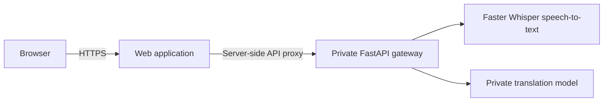

# Dastaan AI

*Translate stories without losing their soul.*

A complete private Urdu assistant that keeps the existing speech-to-Urdu workflow and adds one-tap, natural Urdu-to-English translation.

## Included features

- Type Urdu directly or record Urdu speech and convert it to Urdu text.
- Translate the generated Urdu into fluent, context-aware English.
- Preserve the original Urdu, paragraphs, and line breaks.
- Copy Urdu and English independently.
- Loading, ready, offline, transcription, copy, and error states.
- Responsive Midnight Command Center interface.
- Self-hosted speech recognition with Faster Whisper.
- Self-hosted translation with either a compact Marian model or a private vLLM server.
- API-key authentication, constant-time credential checks, request size limits, rate limiting, CORS and host allowlists, HTTPS enforcement, security headers, request IDs, and no content logging or persistence.
- CPU and GPU deployment paths with Docker.

## Architecture



The browser never receives the private backend API key. Audio and text pass through server-side routes to the private gateway. The gateway is stateless and does not log or retain user content.

## Quick start with Docker

1. Copy `.env.example` to `.env`.
2. Replace `TRANSLATION_API_KEY` with a random value of at least 32 characters.
3. Run:

```bash
docker compose up --build
```

Open `http://localhost:3000`. The first speech or translation request downloads the configured private model weights into the `model-cache` volume. After preloading the weights, set `HF_HUB_OFFLINE=1` for an air-gapped deployment.

The default CPU profile uses the Apache-2.0 licensed `Helsinki-NLP/opus-mt-ur-en` model. For higher-quality contextual translation, use the GPU profile with a locally hosted vLLM-compatible model:

```bash
docker compose -f docker-compose.yml -f docker-compose.gpu.yml up --build
```

Model output must be evaluated with your own conversational, formal, long-form, and mixed Urdu-English test set before production use. The model can be replaced entirely through environment variables without changing application code.

## Run without Docker

Frontend:

```bash
npm install
npm run dev
```

Backend:

```bash
cd backend
python -m venv .venv
# Windows: .venv\Scripts\activate
# macOS/Linux: source .venv/bin/activate
pip install -r requirements-dev.txt
cp .env.example .env   # then set TRANSLATION_API_KEY inside it
uvicorn app.main:app --reload
```

The backend loads `backend/.env` automatically (via `python-dotenv`) when run this way, so `TRANSLATION_API_KEY` and the other settings in `backend/.env.example` don't need to be exported into the shell by hand. If the backend fails to start with `TRANSLATION_API_KEY must be at least 32 characters`, that `.env` file is missing or empty - this is also the cause if the web app reports "the private speech recognition/translation service is unavailable" while the backend process isn't running at all.

Set `TRANSLATION_API_URL=http://localhost:8000` and the same `TRANSLATION_API_KEY` for the web application (root `.env.local`, matching `backend/.env`). The npm scripts are cross-platform and do not use shell-only environment-variable syntax.

The first request for each model (translation, speech-to-text, speech synthesis) downloads its weights from Hugging Face and caches them under `MODEL_CACHE_DIR`. Every restart re-checks Hugging Face for updates even when the weights are already cached, which fails slowly (and can trip `REQUEST_TIMEOUT_SECONDS`) on an unreliable connection. Once all the models you use have been downloaded once, set `HF_HUB_OFFLINE=1` and `TRANSFORMERS_OFFLINE=1` before starting `uvicorn` to skip that check and load straight from the local cache.

## API

- `GET /health` - lightweight readiness/configuration status.
- `POST /api/v1/transcribe` - authenticated multipart audio upload; returns Urdu text. When `ENABLE_TRANSCRIPT_CORRECTION=true` (default), `text` is a best-effort grammar/punctuation-corrected version produced by a local Ollama model, `raw_text` is the unmodified speech-to-text output, and `corrected` indicates whether correction actually ran (it silently falls back to the raw transcript on any failure). This correction is not guaranteed accurate - manual testing found it sometimes misses real grammar mistakes - so treat it as a helpful pass, not a proofreading guarantee.
- `POST /api/v1/translate` - authenticated JSON request; returns English while preserving line breaks.
- `POST /api/v1/speak` - authenticated JSON request (`{"text": "..."}`); returns Urdu speech as a `audio/wav` response, synthesized locally with Meta's MMS-TTS (`facebook/mms-tts-urd-script_arabic`). No voice or speed selection is offered - it is a single-speaker model.

Interactive API documentation can be enabled only in controlled environments with `EXPOSE_API_DOCS=true`.

## Verification

```bash
npm run lint
npm run build
cd backend && pytest
```

See [Architecture](docs/ARCHITECTURE.md), [Security and deployment](docs/SECURITY.md), and the root `.env.example` before production deployment.

## Model notes

- The default Urdu-English Marian model is Apache-2.0 licensed and purpose-built for the Urdu-English pair: <https://huggingface.co/Helsinki-NLP/opus-mt-ur-en>
- The optional GPU adapter uses an internally hosted vLLM-compatible endpoint. `Qwen/Qwen2.5-7B-Instruct` is provided as a configurable example and is Apache-2.0 licensed: <https://huggingface.co/Qwen/Qwen2.5-7B-Instruct>
- No hosted inference provider is called by this project.
